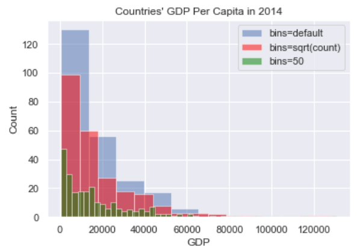
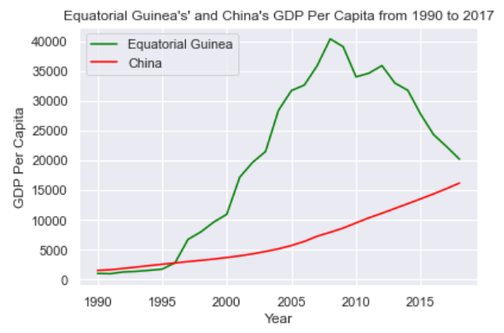
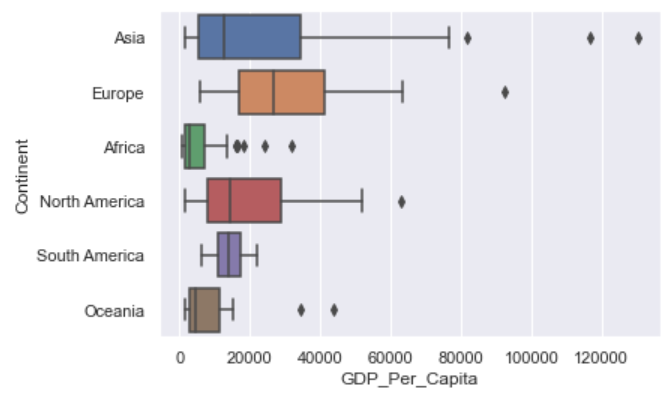
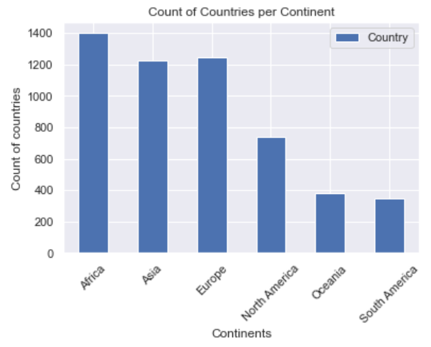
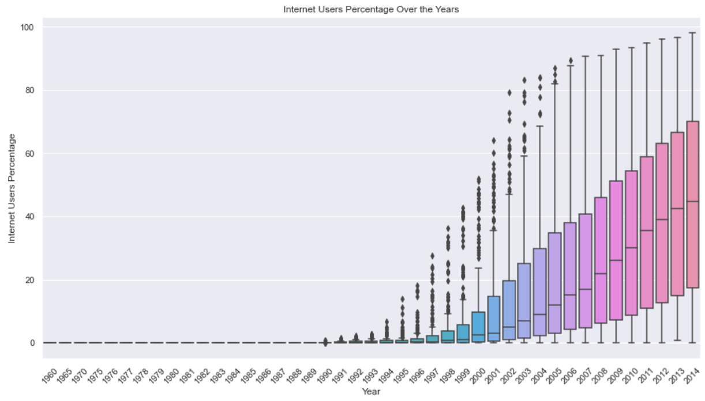
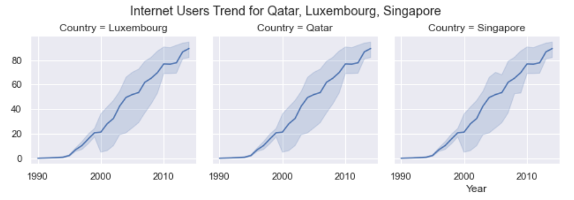
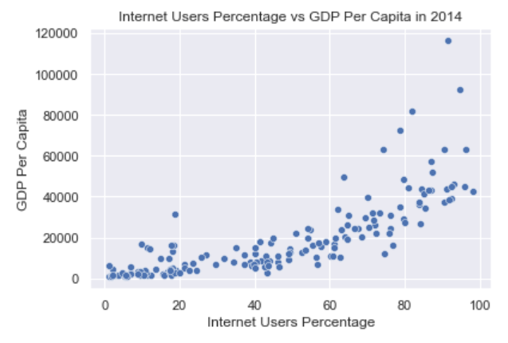
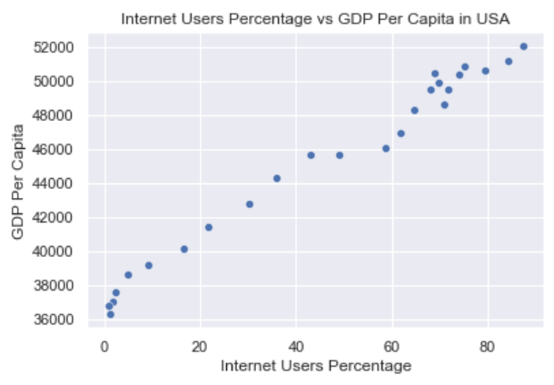

# Data Question 1: An Exploration of UN data

## Synopsis

This is an initiation and a guided practice of the Data Science Lifecycle. In this practice, we analyze the [GDP per Capita of countries](http://data.un.org/Data.aspx?d=WDI&f=Indicator_Code%3aNY.GDP.PCAP.PP.KD) and the [Percentage of Individuals using the Internet](http://data.un.org/Data.aspx?d=ITU&f=ind1Code%3aI99H) from the data provided by the [data.un.org](http://data.un.org). This is a guided practice followed by a Solo analysis.

In this exercise, we mainly focused on running EDA.

## Exploration and Findings

The GDP dataset has 6729 entries, representing 29 years, from 1990 to 2018. Although the years are not exactly equally distributed, they are around ~200 entries per year.

In terms of countries, 243 countries are represented in the dataset. However, some countries have very few observations. It is possible that these countries are very small countries and might have not have the required resources to run the statistical studies of their GDP multiple times...

### Taking A Peek in 2014

Taking a peek at the year 2014 helps us to get an idea of what the distribution look like over one-year period. We see that the distribution is *right-skewed*: There is a lot of countries with low GDP and few countries with high GDP. There is a large variation as the mean GDP is `18,034.30` and the standard deviation is `19,320.93`. The minimum GDP is `672.68` and the maximum GDP is `13,0439.11`.

The top GDP country in this year was **China**, while the bottom 5 GDP where mostly for countries in Africa: Central African Republic, Burundi, Dem. Rep. Congo, Niger, and Malawi.

### GDP Changes Between 1990 and 2017

Between 1990 and 2017, 18 countries experienced a negative percent change in GDP per capita. Among them, *Equatorial Guinea* experienced the highest percent change in GDP per capita. *China* is second.

Comparing the trendline of their GDPs over the years, we can see that they are at about the same level in 2017. There is a large variation between the 2 countries' GDP. For Equatorial Guinea, it was a fast growth followed by a fast decline. For China, it was a steady growth over the years.

Looking at the trend line of changes for *Equatorial Guinea*, we see that its GDP increased really fast between 1995 and 2009. But then, once the economical crisis of 2008 hit, it started dropping really fast. The country was most likely highly affected by the global financial crisis of 2008 and has not recovered since then.

On the other hand, comparing this with China's performance over the years, we see that China had a really steady and constant pace in its GDP growth. It appears that China was not affected by the economic crisis in terms of GDP. It has been climbing and it is still climbing.

### Zooming out on 2014

If we zoom out a bit on 2014 and look at GDP on the continental level, we see that there is a lot of variation of GDP per Capita per continent.

Africa, South America, and Oceania has lesser IQR in terms of the variation and are mostly on the lower values. Asia, Europe, and North America have larger IQR. There is a lot of outliers for almost any continent except in South America. Thos shows that, overall, GDP distribution is all over the place worldwide.

However, let's not forget that the number of countries per continent is also a factor in this distribution.

### Internat Usage

Looking at the *Internet Usage* dataset, we wanted to understand if Internet plays a role in the GDP of a country at all.

It was in 1990 that we have first year that has a nonzero internet users percentage reported. 

Overall, the general trend of internet users percentage over the years is increasing. It really started exploding at the end of the 1990s, beginning of the 2000s.

### Effects of Internet on GDP

If we focus again on 2014, we see that the mean internet users percentage in this year was 45%. The leading countries that have at least 90% internet users were mostly in Europe (Iceland, Norway, Denmark, Luxembourg, Netherlands, Sweden, Finland, United Kingdom), but also includes countries from the Middle-East (Qatar, Bahrain, United Arab Emirates) and Far-East (Japan)

We see that there is a correlation between Internet Usage and GDP because the top 3 GDP countries for this year were also Qatar, Luxembourg, and Singapore. The trends for each country are very similar and almost the same.

And if we look at the scatterplot of GDP vs Internat Usage, we see that there is a positive linear correlation between *Internet Users Percentage* and *GDP Per Capita*: As *GDP Per Capita* increases, *Internet Users Percentage* increases as well.

The Pearson's correlation for this relationship is 0.79. It means that there is a strong positive linear correlation between the 2 variables.

### What about the United States?

Although USA is not among the top GDP in 2014, we notice that its GDP is also highly correlated with its Internet Usage.

